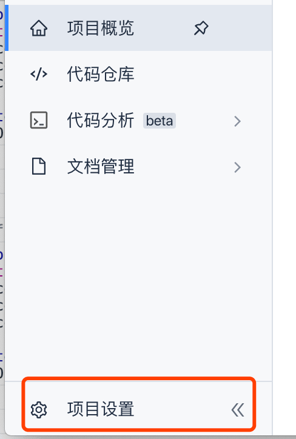
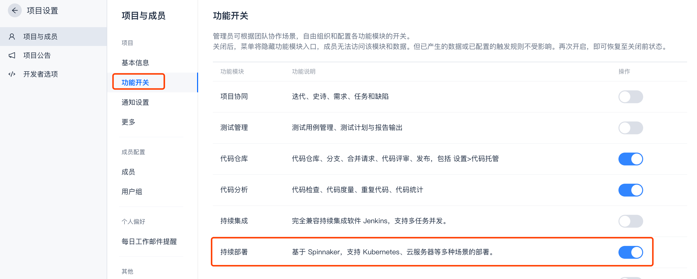
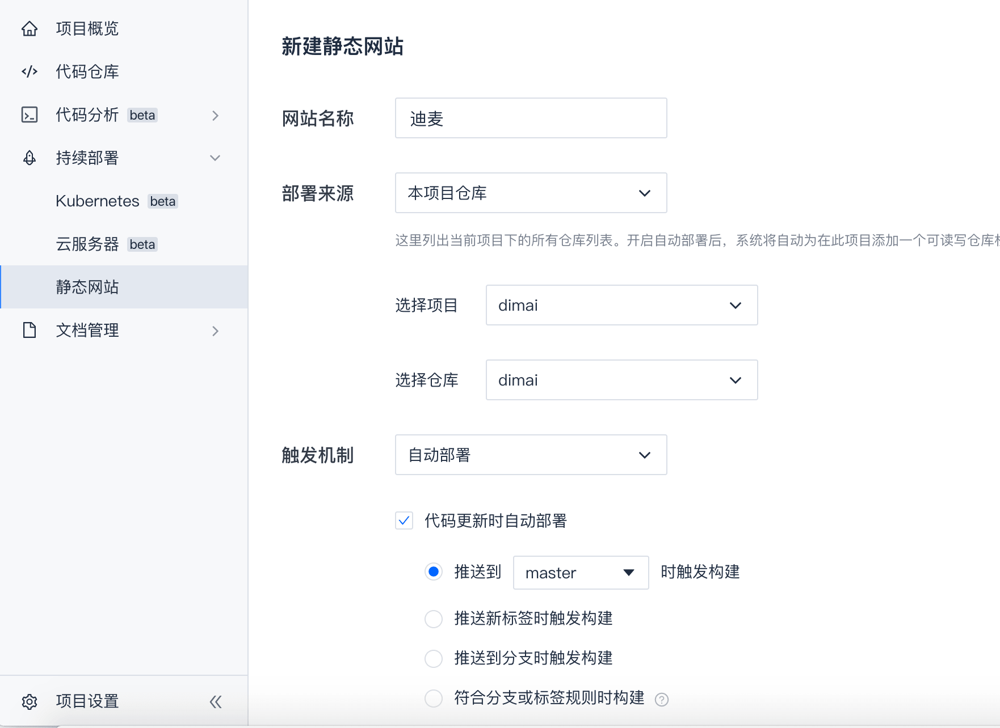
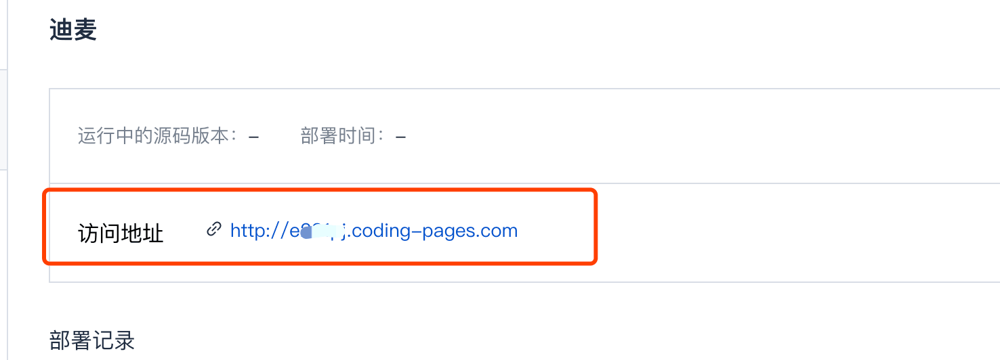
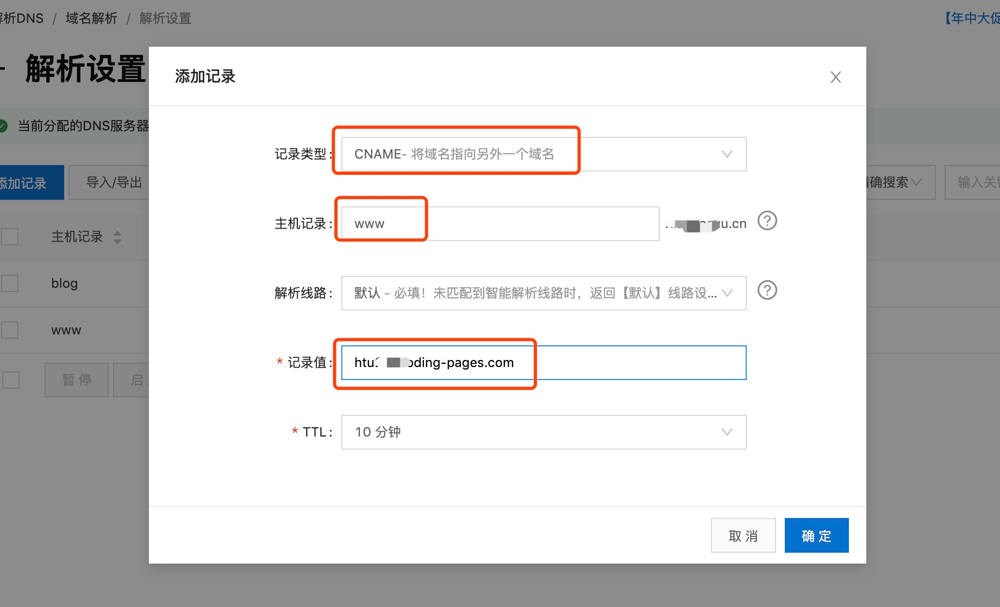
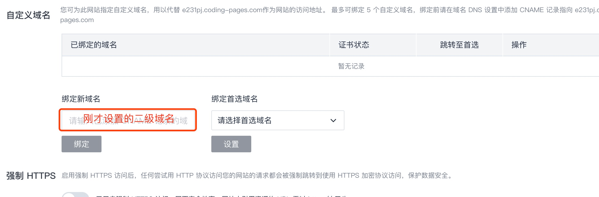

# 本文讲述如何在coding.net上发布静态网站，以个人博客为例

### 第一步：注册coding.net账号
[点击注册](https://coding.net/)，怎么注册就不详细介绍了，注册完成，需要进行实名认证，之后创建一个项目blog  

### 第二步：添加持续部署功能
::: warning
这一步非常坑，默认在你的项目中是没有这项功能的，需要自己添加
:::
进入到刚才创建的blog项目中，点击项目设置 -> 功能开关 -> 持续部署 打开，如图: 

### 第三步：发布静态网站

返回项目设置后会发现持续部署功能已经显示 -> 选择静态网站 -> 立即发布静态网站（必须要实名认证），如图: 

填写完信息保存后，会随机生成访问该项目根目录的地址： 

### 第四步：绑定自定义域名
是不是感觉系统随机生成的地址很low，绑定一个炫酷的域名吧！

首先去阿里云购买一个喜欢的域名，完成一系列的认证后，进行域名解析 -> 添加记录： 

记录类型：CNAME

主机记录：www（一般选择www，其实就是配置二级域名，可以随便设置）

解析线路：默认

记录值：coding中随机生成的地址

TTL：默认10分钟

完成上述操作后，进入到conding静态网站 -> 点击右上角设置，找到自定义域名：

点击绑定，审核通过后，即可访问，默认访问该项目下根目录的index.html
