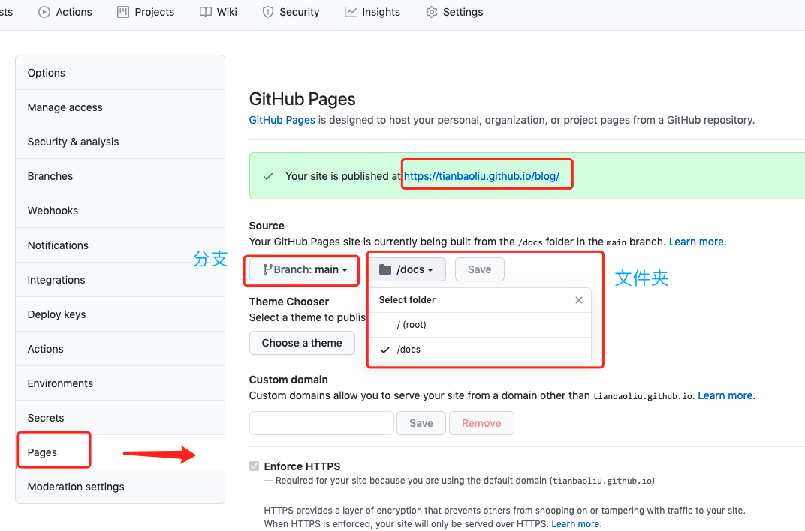
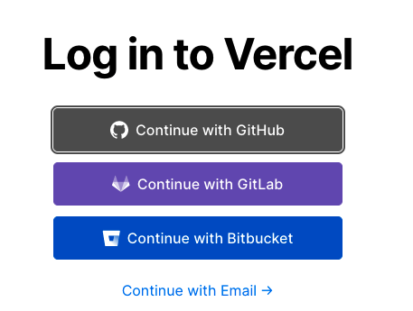
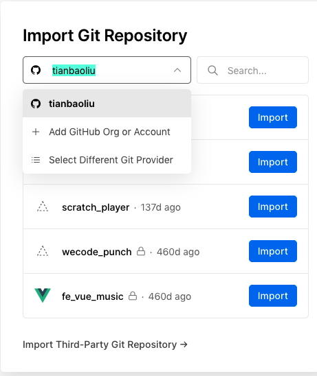
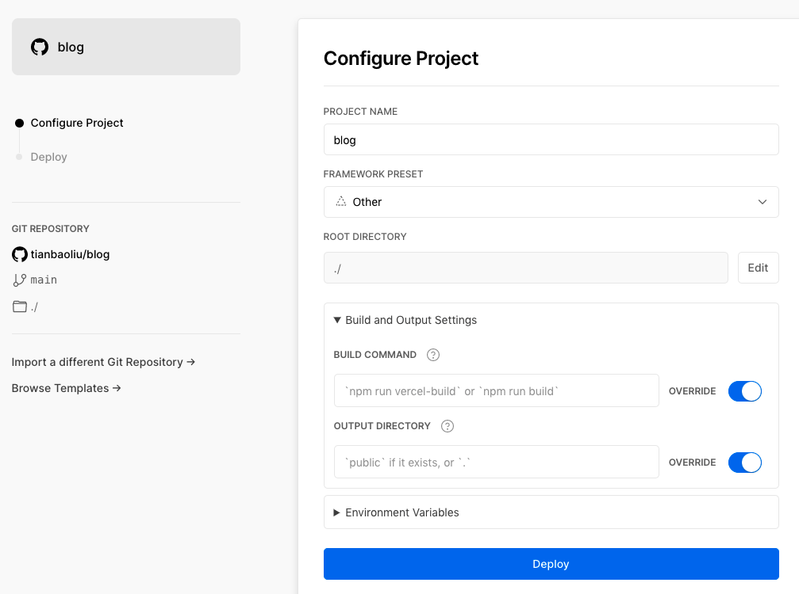
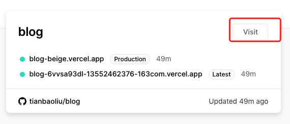

# 本文讲述如何在vercel上托管网站，以个人博客为例

::: warning
官网：https://vercel.com/
:::

### 第一步：在GitHub上将项目设置为静态网站托管
在托管的项目 --> Settings --> Pages --> Source选项 

Source第一项选择要部署的分支，第二项选择托管部署的文件夹【 /(root)根目录、/docs目录(选择此选项时，记得打包项目时打成docs文件夹)】 

此时托管完成GitHub会分配一个访问地址，形如：https://xxx.github.io/xxx/的形式，此地址能访问通就代表托管成功，如果资源路径或许出现问题，不要纠结，因为我们不是托管在GitHub上 

### 第二步：注册vercel账号
[点击注册](https://vercel.com/)，可以使用GitHub、GitLab、Bitbucket等三种方式注册登录  

### 第三步：从GitHub引入项目到vercel
点击NewProject，Import Git Repository 选择一种方式引入项目，点击import引入，如下图所示：

### 第四步：访问项目
点击visit访问自己的博客，记住分配的地址 

::: warning 注意
如果出现资源路径问题，请仔细检查项目内配置的跟路径、打包后的文件名称，尤其是GitHub中选择的 /docs 目录的时候
:::

### 第五步：绑定自定义域名