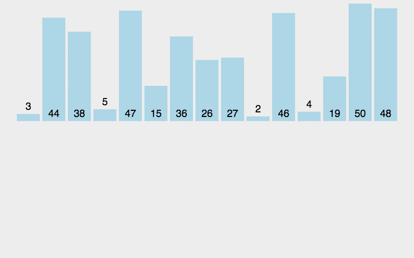

## 1、数组去重
#### 法一、利用ES6 Set去重（ES6中最常用）
```js
Array.from(new Set(arr)
// 简写：
[...new Set(arr)]
```

#### 法二：for循环，splice去重（ES5中最常用）
```js
function unique(arr) {            
    for(var i=0; i<arr.length; i++) {
         // 第一个等同于第二个，splice方法删除第二个
        if(arr[i] == arr[i+1]) {
            arr.splice(i+1,1);
            // 还原位置继续比较
            i--;
        }
    }
    return arr;
}
```

#### 法三：indexOf去重
```js
function unique(arr) {
    let array = [];
    for (let i = 0; i < arr.length; i++) {
        if (array.indexOf(arr[i]) === -1) {
            array.push(arr[i])
        }
    }
    return array;
}
```

#### 法四：利用sort()排序后前后比较去重
```js
function unique(arr) {
    arr = arr.sort()
    var arrry= [arr[0]];
    // 从1开始向前比较
    for (var i = 1; i < arr.length; i++) {
        if (arr[i] !== arr[i-1]) {
            arrry.push(arr[i]);
        }
    }
    return arrry;
}
```

## 2、数组排序
#### 法一：sort()排序
::: warning
sort()方法有一个可选参数，是用来确定元素顺序的函数。如果这个参数被省略，那么数组中的元素将按照ASCII字符顺序进行排序,因此需要传入比较函数
:::
```js
// 定义比较函数
function compare(a, b) {
    // 如果参数为对象，需要按照对象某属性值排序，那么：
    // a = a.属性名;
    // b = b.属性名;

    return a-b; // 生序
    return b-a; // 降序
}
// 调用
arr.sort(compare);
```

#### 法二：冒泡法
```js
function sorts(arr) {
    for (var i = 0; i < arr.length-1; i++) {
        for (var j = 0; j < arr.length-1; j++) {
            // 相邻两值比较大小 交换位置
            if (arr[j] > arr[j+1]) {
                // 借助新变量
                let temp = arr[j];
                arr[j] = arr[j+1];
                arr[j+1] = temp;

                // 不借助新变量
                arr[j] = arr[j] - arr[j+1];
                arr[j+1] = arr[j+1] + arr[j];
                arr[j] = arr[j+1] - arr[j];

                // 不借助新变量
                arr[j+1] = arr[j]-arr[j+1];
                arr[j] = arr[j]-arr[j+1];
                arr[j+1] = arr[j]+arr[j+1];

                // es6解构
                [arr[j],arr[j+1]] = [arr[j+1],arr[j]]
            }
        }
    }
    return arr;
}
```

#### 法三：选择排序
```js
// 从原始数组中找到最小的元素放在数组的最前面，再从剩下的元素中寻找最小的元素，放在之前最小元素的后面
function selectSort(arr){
    var minIndex,temp;
    for(i = 0; i < arr.length-1; i++){
        minIndex = i;
        for(j=i+1;j<arr.length;j++){
            if(arr[j]<arr[minIndex]){
                minIndex = j;
            }
        }
        temp = arr[i];
        arr[i] = arr[minIndex];
        arr[minIndex] = temp;
    }
    return arr;
}
```

#### 法四：插入排序
```js
// 当前值和之前的所有值进行比较，如果当前值小则交换位置
function selectSort(arr){
    var temp;
    for(i = 0; i < arr.length; i++){
        for(j = i; j > 0 && arr[j] > arr[j-1]; j--){
            temp = arr[j];
            arr[j] = arr[j-1];
            arr[j-1] = temp;
        }
    }
    return arr;
}
```
- 插入排序相比选择排序效率快很多，执行图如下：


#### 法五：快速排序
::: tip 原理：
从数组的中间拿一个值（一般取中间值），然后通过这个值挨个和数组里面的值进行比较，如果大于的放一边，小于的放一边，然后把这些合并，再进行比较，如此反复。
:::
```js
var arr = [2, 9, 3, 5, 50, 16, 9, 9, 9, 1]
function qSort(arr) {
    // 如果只有一位，就没有必要比较
    if(arr.length <= 1){
        return arr;
    }
    // 获取中间值的索引
    let pivotIndex = Math.floor(arr.length / 2);
    // 找基准，并把基准从原数组删除
    let pivot = arr.splice(pivotIndex, 1)[0];
    // 定义左右数组
    let left = [];
    let right = [];
    // 比基准小的放在left，比基准大的放在right
    for (let i = 0; i < arr.length; i++) {
        if (arr[i] <= pivot) {
            left.push(arr[i]);
        } else {
            right.push(arr[i]);
        }
    }
    // 通过递归，上一轮比较好的数组合并，并且再次进行比较
    // return qSort(left).concat(pivot,qSort(right)); // ES5
    return [...qSort(left),pivot,...qSort(right)] // ES6
}
console.log(qSort(arr))
```

## 3、bind原理
::: tip
bind用于改变函数体内this的指向，不会立即调用，返回一个新的函数,称为绑定函数，this指向第一个参数，第二个及以后的参数作为原函数的参数来调用原函数（实参）。
:::
实现bind方法
```js
// ES5 实现bind
Function.prototype._bind = function(obj) {
    if(typeof this !== 'function') {
        throw new Error("只有函数才能调用_bind方法")
    }
    let that = this;
    // 去掉第一个参数（obj），得到的参数形如如下场景：test.bind(obj,1,2); 或者 test.bind(obj,1);
    let args1 = Array.prototype.slice.call(arguments, 1);
    return function() {
        // 这里的参数形如下面场景：testObj(1,2) 或者 testObj(2); 返回的绑定函数的参数
        let args2 = Array.prototype.slice.call(arguments);
        // 参数合并作为原函数的参数，形如：function test(a,b)中的a，b
        that.apply(obj,[...args1,...args2]);
    }
}

// ES6写法 实现bind
Function.prototype._bind = function(obj,...args1) {
    if(typeof this !== 'function') {
        throw new Error("只有函数才能调用_bind方法")
    }
    let that = this;
    return function(...args2) {
        that.apply(obj,[...args1,...args2]);
    }
}

// 调用
var obj = {};
function test(a,b) {
    console.log(a)
    console.log(b)
    console.log(this === obj);
}

var testObj = test._bind(obj);
testObj(1,2);  // 1 2 true
// 或者
var testObj = test._bind(obj,1,2);
testObj();  // 1 2 true
// 或者
var testObj = test._bind(obj,1);
testObj(2);  // 1 2 true
// 以上输出结果一致
```

## 4、手写promise.all()
```js
function promiseAll(arr) {
    const promiseArr = Array.from(arr)
    const len = promiseArr.length
    let count = 0
    let resultArr = []
    return new Promise((resolve,reject) => {
        promiseArr.forEach(p => {
            Promise.resolve(p).then(res => {
                count++
                resultArr.push(res)
                if(count === len) {
                    return resolve(resultArr)
                }
            }).catch(e => {
                reject(e)
            })
        })
    })
}
const p1 = new Promise((resolve, reject) => {
    // return reject('p1抛出错误')
    return resolve(111)
}).then((val) => {
    return val
})

const p2 = new Promise((resolve, reject) => {
    return resolve(222);
}).then((val) => {
    return val
})
promiseAll([p1, p2]).then((val) => {
    console.log(val)    // [111, 222]
})
```

## 5、深拷贝和浅拷贝
```js
// 浅拷贝
let a = {name : '哈哈'}

let copyA1 = Object.assign({}, a)
copyA1.name = '你好'
console.log(a.name) // 哈哈
console.log(copyA1.name) // 你好

let copyA2 = JSON.parse(JSON.stringify(a))
copyA2.age = 20
console.log(copyA2.age) // 20

// 深拷贝
function deepCopy(obj) {
    var copyObj = obj instanceof Array ? [] : {};
    for (const i in obj) {
        if (obj.hasOwnProperty(i)) { // 判断对象是否包含特定的自身（非继承）属性。
            if (typeof obj[i] === 'object' && obj[i] !== null) {
                copyObj[i] = deepCopy(obj[i])
            } else {
                copyObj[i] = obj[i]
            }
        }
    }
    return copyObj
}
let a1 = {
    age: 1,
    arr: [2,3,5],
    jobs: {
        first: 'FE'
    }
}
let copyA = deepCopy(a1)
copyA.age = 40
copyA.arr[1] = 2222
console.log(a1)
console.log(copyA)
```

## 5、new的实现